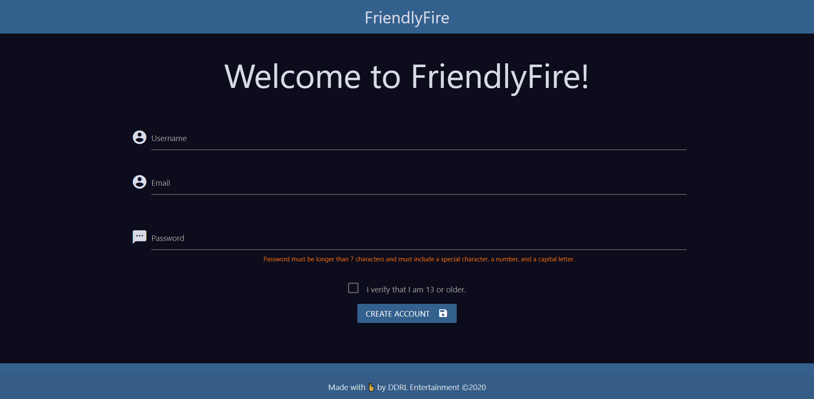
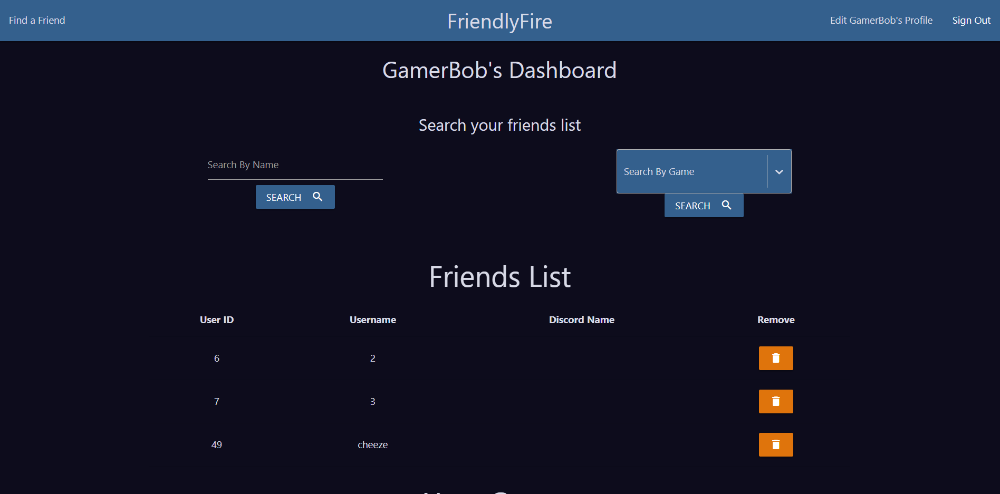
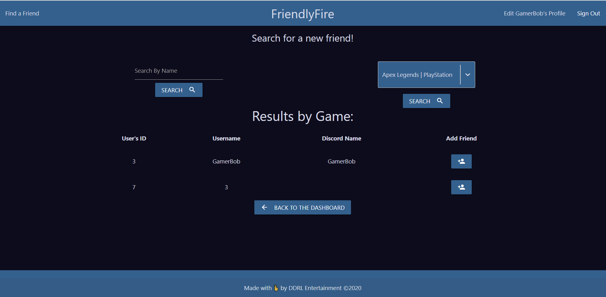

# FriendlyFire

## Description
A new gen way of finding new gaming friends. Create an account and add the games you want to find friends for. Search for friends based on the your games and message them over their discord to play. Manage your friends and games listsas your preference change. 

## Screenshots

### Sign in 

### Create Account

### Find Games

### Dashboard

### Find Friends

## Technologies
* Node.js
* Express
* MySQL & Sequelize ORM
* React.js
* Materialize CSS
* jasonwebtoken

## Collaborators
 

 
 

## Links
Deployed to heroku: https://secure-tor-59417.herokuapp.com/
